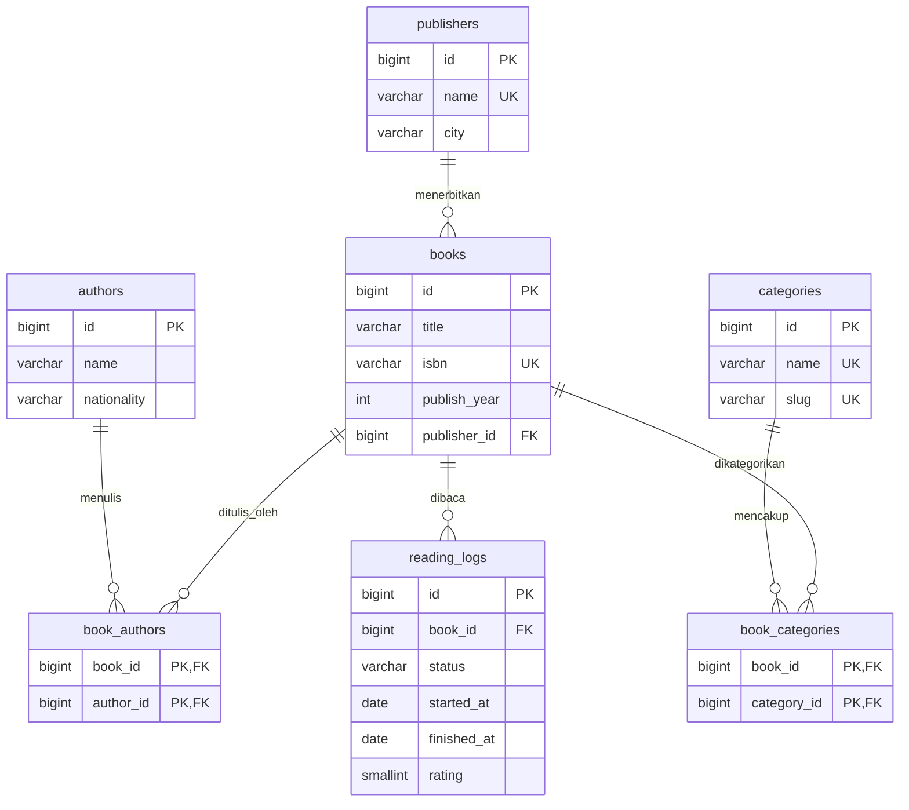

# DATABASE-DESIGN

Skema **final**, 7 tabel, dinormalisasi sampai 3NF. Database: PostgreSQL 18. Migration: Flyway.

## 1. ER Diagram


## 2. DDL — `V1__init.sql`
Lokasi: `src/main/resources/db/migration/V1__init.sql`

```sql
-- ============ MASTER ============
CREATE TABLE authors (
    id          BIGINT GENERATED ALWAYS AS IDENTITY PRIMARY KEY,
    name        VARCHAR(150) NOT NULL,
    nationality VARCHAR(80)
);

CREATE TABLE publishers (
    id   BIGINT GENERATED ALWAYS AS IDENTITY PRIMARY KEY,
    name VARCHAR(150) NOT NULL,
    city VARCHAR(80),
    CONSTRAINT uq_publishers_name UNIQUE (name)
);

CREATE TABLE categories (
    id   BIGINT GENERATED ALWAYS AS IDENTITY PRIMARY KEY,
    name VARCHAR(80) NOT NULL,
    slug VARCHAR(80) NOT NULL,
    CONSTRAINT uq_categories_name UNIQUE (name),
    CONSTRAINT uq_categories_slug UNIQUE (slug),
    CONSTRAINT ck_categories_slug CHECK (slug ~ '^[a-z0-9]+(-[a-z0-9]+)*$')
);

-- ============ BUKU ============
CREATE TABLE books (
    id           BIGINT GENERATED ALWAYS AS IDENTITY PRIMARY KEY,
    title        VARCHAR(255) NOT NULL,
    isbn         VARCHAR(13),
    publish_year INT,
    publisher_id BIGINT NOT NULL,
    CONSTRAINT uq_books_isbn UNIQUE (isbn),
    CONSTRAINT ck_books_isbn CHECK (isbn ~ '^([0-9]{9}[0-9X]|[0-9]{13})$'),
    CONSTRAINT ck_books_publish_year CHECK (publish_year BETWEEN 1000 AND 2100),
    CONSTRAINT fk_books_publisher FOREIGN KEY (publisher_id)
        REFERENCES publishers (id) ON DELETE RESTRICT
);
CREATE INDEX idx_books_publisher_id ON books (publisher_id);
CREATE INDEX idx_books_title        ON books (lower(title));

-- ============ JUNCTION ============
CREATE TABLE book_categories (
    book_id     BIGINT NOT NULL,
    category_id BIGINT NOT NULL,
    PRIMARY KEY (book_id, category_id),
    CONSTRAINT fk_bc_book     FOREIGN KEY (book_id)     REFERENCES books (id)      ON DELETE CASCADE,
    CONSTRAINT fk_bc_category FOREIGN KEY (category_id) REFERENCES categories (id) ON DELETE RESTRICT
);
CREATE INDEX idx_book_categories_category_id ON book_categories (category_id);

CREATE TABLE book_authors (
    book_id   BIGINT NOT NULL,
    author_id BIGINT NOT NULL,
    PRIMARY KEY (book_id, author_id),
    CONSTRAINT fk_ba_book   FOREIGN KEY (book_id)   REFERENCES books (id)   ON DELETE CASCADE,
    CONSTRAINT fk_ba_author FOREIGN KEY (author_id) REFERENCES authors (id) ON DELETE RESTRICT
);
CREATE INDEX idx_book_authors_author_id ON book_authors (author_id);

-- ============ LOG MEMBACA ============
CREATE TABLE reading_logs (
    id          BIGINT GENERATED ALWAYS AS IDENTITY PRIMARY KEY,
    book_id     BIGINT      NOT NULL,
    status      VARCHAR(10) NOT NULL,
    started_at  DATE,
    finished_at DATE,
    rating      SMALLINT,
    CONSTRAINT fk_rl_book FOREIGN KEY (book_id) REFERENCES books (id) ON DELETE CASCADE,
    CONSTRAINT ck_rl_status CHECK (status IN ('WISHLIST', 'READING', 'DONE')),
    CONSTRAINT ck_rl_rating CHECK (rating BETWEEN 1 AND 5),
    CONSTRAINT ck_rl_dates  CHECK (finished_at IS NULL OR started_at IS NULL OR finished_at >= started_at),
    CONSTRAINT ck_rl_done   CHECK (status <> 'DONE' OR finished_at IS NOT NULL),
    CONSTRAINT ck_rl_rating_done CHECK (rating IS NULL OR status = 'DONE')
);
CREATE INDEX idx_reading_logs_book_id ON reading_logs (book_id);
CREATE INDEX idx_reading_logs_status  ON reading_logs (status);
```

Catatan desain constraint:
- `isbn` boleh `NULL` (buku lama), dan PostgreSQL mengizinkan banyak `NULL` pada kolom `UNIQUE`. Disimpan **tanpa tanda hubung**: 10 digit (digit terakhir boleh `X`) atau 13 digit.
- `ON DELETE CASCADE` hanya dari `books` ke tabel turunannya. Penulis, kategori, dan penerbit yang masih dipakai **tidak bisa dihapus** (`RESTRICT`); API mengubahnya menjadi 409.
- Aturan `DONE ⇒ finished_at` dan `rating ⇒ DONE` adalah aturan bisnis tambahan di level DB, bukan perubahan struktur skema.

## 3. Penjelasan per Tabel

| Tabel | Mengapa dipisah | Normalisasi | Anomali yang dicegah |
|---|---|---|---|
| `authors` | Penulis punya atribut sendiri (kebangsaan) dan menulis banyak buku | 3NF: `nationality` bergantung pada `id` penulis, bukan pada buku | *Update*: ganti kebangsaan sekali, bukan di tiap buku. *Insert*: penulis bisa ada tanpa buku. |
| `publishers` | Kota adalah atribut penerbit, bukan buku | 3NF: `city` bergantung pada `publisher_id` (dependensi transitif dari `books` dibuang) | *Update*: kota berubah di satu baris. *Inkonsistensi*: "Gramedia, Jakarta" vs "Gramedia, Jkt". |
| `categories` | Kategori dipakai banyak buku dan punya `slug` untuk URL/filter | 3NF: `name`, `slug` hanya bergantung pada `id` | *Duplikasi* dan salah ketik nama kategori. |
| `books` | Entitas inti; hanya memuat fakta tentang buku itu sendiri | 3NF: semua kolom non-key bergantung langsung pada `id`. `publish_year` = kolom biasa, bukan tabel | Kolom multi-nilai dipindah ke junction (1NF). |
| `book_categories` | Relasi M:N buku–kategori | 1NF: tidak ada `"Fiksi, Sejarah"` dalam satu sel. 2NF: PK gabungan, tanpa kolom non-key | *Insert*: kategori tak terbatas per buku. *Delete*: hapus relasi tanpa menghapus buku atau kategori. |
| `book_authors` | Relasi M:N buku–penulis (ko-penulis) | Sama seperti di atas | Memaksa satu penulis per buku, atau nama penulis sebagai string dipisah koma (melanggar 1NF). |
| `reading_logs` | Satu buku bisa dibaca berkali-kali; status dan rating milik **peristiwa membaca**, bukan buku | 3NF: `rating`, `status`, tanggal bergantung pada `id` log | Rating di `books` akan menimpa riwayat baca ulang dan mencampur fakta buku dengan fakta pembaca. |

**Kenapa `publish_year`, `status` bukan tabel?** Keduanya domain nilai tunggal tanpa atribut lain. Tabel lookup hanya menambah `JOIN` untuk mendapatkan satu nilai. Cukup kolom biasa + `CHECK`.

**Tidak ada `users`.** Rak buku pribadi, satu pengguna. Ditambahkan di fase 2 lewat migration baru.

## 4. Catatan Trade-off (disengaja)
Jika karya yang sama diterbitkan ulang oleh penerbit berbeda di tahun berbeda, baris `books` akan memiliki judul yang berulang (*update anomaly* ringan). Solusi sempurna: pisah menjadi `works` (judul + penulis) dan `editions` (penerbit + tahun + ISBN). Untuk proyek latihan tahap awal ini hal tersebut **sengaja tidak dilakukan** karena kompleksitasnya tidak sepadan. Ini keputusan desain yang disengaja, bukan celah yang terlewat.

## 5. Seed Data (dev)
Lokasi: `src/main/resources/db/seed/V100__seed_dev.sql`. Hanya aktif pada profil `dev`. ISBN di bawah adalah contoh untuk pengujian.

```sql
INSERT INTO publishers (name, city) VALUES
    ('Bentang Pustaka',        'Yogyakarta'),
    ('Lentera Dipantara',      'Jakarta'),
    ('Harper',                 'New York'),
    ('Addison-Wesley',         'Boston');

INSERT INTO authors (name, nationality) VALUES
    ('Andrea Hirata',        'Indonesia'),
    ('Pramoedya Ananta Toer','Indonesia'),
    ('Yuval Noah Harari',    'Israel'),
    ('Andrew Hunt',          'Amerika Serikat'),
    ('David Thomas',         'Inggris');

INSERT INTO categories (name, slug) VALUES
    ('Fiksi',    'fiksi'),
    ('Sejarah',  'sejarah'),
    ('Teknologi','teknologi'),
    ('Sastra',   'sastra');

INSERT INTO books (title, isbn, publish_year, publisher_id) VALUES
    ('Laskar Pelangi',            '9789793062792', 2005, (SELECT id FROM publishers WHERE name = 'Bentang Pustaka')),
    ('Bumi Manusia',              '9789799731234', 2005, (SELECT id FROM publishers WHERE name = 'Lentera Dipantara')),
    ('Sapiens',                   '9780062316097', 2015, (SELECT id FROM publishers WHERE name = 'Harper')),
    ('The Pragmatic Programmer',  '9780201616224', 1999, (SELECT id FROM publishers WHERE name = 'Addison-Wesley'));

INSERT INTO book_authors (book_id, author_id)
SELECT b.id, a.id FROM books b JOIN authors a ON (b.title, a.name) IN (
    ('Laskar Pelangi',           'Andrea Hirata'),
    ('Bumi Manusia',             'Pramoedya Ananta Toer'),
    ('Sapiens',                  'Yuval Noah Harari'),
    ('The Pragmatic Programmer', 'Andrew Hunt'),
    ('The Pragmatic Programmer', 'David Thomas')   -- ko-penulis
);

INSERT INTO book_categories (book_id, category_id)
SELECT b.id, c.id FROM books b JOIN categories c ON (b.title, c.slug) IN (
    ('Laskar Pelangi',           'fiksi'),
    ('Laskar Pelangi',           'sastra'),
    ('Bumi Manusia',             'fiksi'),
    ('Bumi Manusia',             'sejarah'),
    ('Sapiens',                  'sejarah'),
    ('The Pragmatic Programmer', 'teknologi')
);

INSERT INTO reading_logs (book_id, status, started_at, finished_at, rating)
SELECT id, 'DONE',     DATE '2026-01-05', DATE '2026-01-20', 5    FROM books WHERE title = 'Laskar Pelangi' UNION ALL
SELECT id, 'DONE',     DATE '2026-06-01', DATE '2026-06-10', 4    FROM books WHERE title = 'Laskar Pelangi' UNION ALL  -- baca ulang
SELECT id, 'READING',  DATE '2026-09-15', NULL,              NULL FROM books WHERE title = 'Sapiens'        UNION ALL
SELECT id, 'WISHLIST', NULL,              NULL,              NULL FROM books WHERE title = 'The Pragmatic Programmer';
```
Data ini menunjukkan: buku dengan 2 penulis, buku dengan 2 kategori, satu buku dibaca dua kali (dua log), dan ketiga nilai status.
